<!-- ═══════════════════════ ANIMATED HEADER ═══════════════════════ -->
<div align="center">


<a href="https://referal-hub-frontend.vercel.app/">
  
</a>

<br/>

[](https://referal-hub-frontend.vercel.app/)
[](https://github.com/ashrithBalaji456/Referal_Hub_Frontend)
[](https://github.com/ashrithBalaji456/Referal_Hub_Backend)


</div>


## 📑 Table of Contents

| | | |
|---|---|---|
| [📌 About](#-about-the-project) | [✨ Features](#-features) | [🧰 Tech Stack](#-tech-stack) |
| [🏗️ Architecture](#️-system-architecture) | [🔄 Workflows](#-workflow-charts) | [🗃️ Data Model](#️-data-model) |
| [📊 Data Charts](#-data--analytics-charts) | [📡 API](#-api-overview) | [⚙️ Setup](#️-local-setup) |
| [🔐 Security](#-security--configuration-practices) | [🧪 Testing](#-testing-strategy) | [🗺️ Roadmap](#️-roadmap) |

---

## 📌 About the Project

**Referral Hub** is a full-stack outreach automation platform built to simplify and organize job-application and referral workflows.

Instead of writing the same email again and again, the app centralizes:

<div align="center">

| 👥 Contacts | 📝 Templates | 📎 Resumes | 📅 Scheduling |
|:---:|:---:|:---:|:---:|
| Professional contact management | Reusable subject & body | PDF attachments | Cron-based campaigns |
| 🛡️ Safety | 🔁 Cooldown | 🧬 Personalization | 📊 History |
| Duplicate-send prevention | Recipient eligibility rules | `{{placeholder}}` replacement | Full email activity log |

</div>

The project started as a practical learning exercise around **Spring Scheduler** and **Spring Mail**, then grew into a complete full-stack campaign-management system. **Built in July 2026.**

> [!IMPORTANT]
> Referral Hub is designed for controlled and responsible professional outreach. Verify contact information, respect opt-out requests, avoid repeated unsolicited emails, and follow applicable laws and provider policies.

---

## 🌐 Live Demo & Repositories

<div align="center">

| Component | Link | Stack |
|:---:|:---|:---|
| 🚀 **Live App** | [referal-hub-frontend.vercel.app](https://referal-hub-frontend.vercel.app/) | Hosted on Vercel |
| 🎨 **Frontend** | [Referal_Hub_Frontend](https://github.com/ashrithBalaji456/Referal_Hub_Frontend) | React 18 · Vite · Tailwind · Axios |
| ⚙️ **Backend** | [Referal_Hub_Backend](https://github.com/ashrithBalaji456/Referal_Hub_Backend) | Spring Boot 3.3.1 · JPA · PostgreSQL |

</div>

---

## ✨ Features

<details open>
<summary><b>👥 Contact Management</b></summary>

- Create, update, view, activate, and deactivate professional contacts
- Store recipient name, email, company, title, and contact category
- Prevent duplicate email records
- Track contact status and previous outreach activity
- Exclude invalid, bounced, inactive, or do-not-contact recipients
</details>

<details open>
<summary><b>📝 Reusable Email Templates</b></summary>

- Store reusable subject and body templates
- Personalize with placeholders: `{{recipientName}}` · `{{companyName}}` · `{{candidateName}}` · `{{roleName}}`
- Preview personalized content before campaign execution
</details>

<details open>
<summary><b>📎 Resume Attachment Management</b></summary>

- Upload PDF resumes with file type and size validation
- Store resume metadata and select the active resume per campaign
- Attach the selected PDF using MIME email support
</details>

<details open>
<summary><b>📅 Scheduled Campaigns</b></summary>

- Run campaigns through Spring Scheduler with cron expressions (weekly by default)
- Configurable scheduler timezone
- Process controlled batches instead of uncontrolled mass sends
</details>

<details open>
<summary><b>📬 Email Delivery Workflow</b></summary>

- Build personalized MIME messages and send through SMTP via Spring Mail
- Continue processing other recipients if one send fails
- Track submission and failure states
</details>

<details open>
<summary><b>🛡️ Outreach Safety Controls</b></summary>

- Duplicate-send prevention and configurable cooldown period
- Recipient eligibility checks and batch-size control
- Contact activation/deactivation, bounce-aware status design, `DO_NOT_CONTACT` handling
</details>

<details open>
<summary><b>📊 Activity & History</b></summary>

- Store every email attempt with recipient, campaign, subject, timestamp, and status
- Preserve error details for failed attempts to support auditing and debugging
</details>

### 🧠 Feature Map

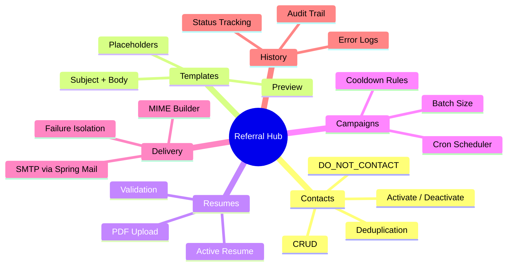
```mermaid
mindmap
  root((Referral Hub))
    Contacts
      CRUD
      Deduplication
      Activate / Deactivate
      DO_NOT_CONTACT
    Templates
      Subject + Body
      Placeholders
      Preview
    Resumes
      PDF Upload
      Validation
      Active Resume
    Campaigns
      Cron Scheduler
      Batch Size
      Cooldown Rules
    Delivery
      MIME Builder
      SMTP via Spring Mail
      Failure Isolation
    History
      Status Tracking
      Error Logs
      Audit Trail
```

---

## 🧰 Tech Stack

<div align="center">


</div>

| Layer | Technologies |
|:---|:---|
| 🎨 **Frontend** | React 18, Vite, Tailwind CSS, Axios, Lucide React |
| ⚙️ **Backend** | Java 17, Spring Boot 3.3.1 |
| 🔌 **API** | Spring Web, REST APIs |
| 💾 **Persistence** | Spring Data JPA, Hibernate |
| 🐘 **Database** | PostgreSQL |
| ✅ **Validation** | Jakarta Bean Validation |
| 📧 **Email** | Spring Mail, SMTP, MIME attachments |
| ⏰ **Automation** | Spring Scheduler, Cron expressions |
| 🛠️ **Build** | Maven (backend), npm + Vite (frontend) |
| 📜 **Logging** | SLF4J |
| 🧪 **Testing** | Spring Boot Test, H2 |
| 📮 **API Testing** | Postman |
| ☁️ **Hosting** | Vercel (frontend) |
| 🔧 **VCS** | Git, GitHub |

### Tech Stack Share (by layer)

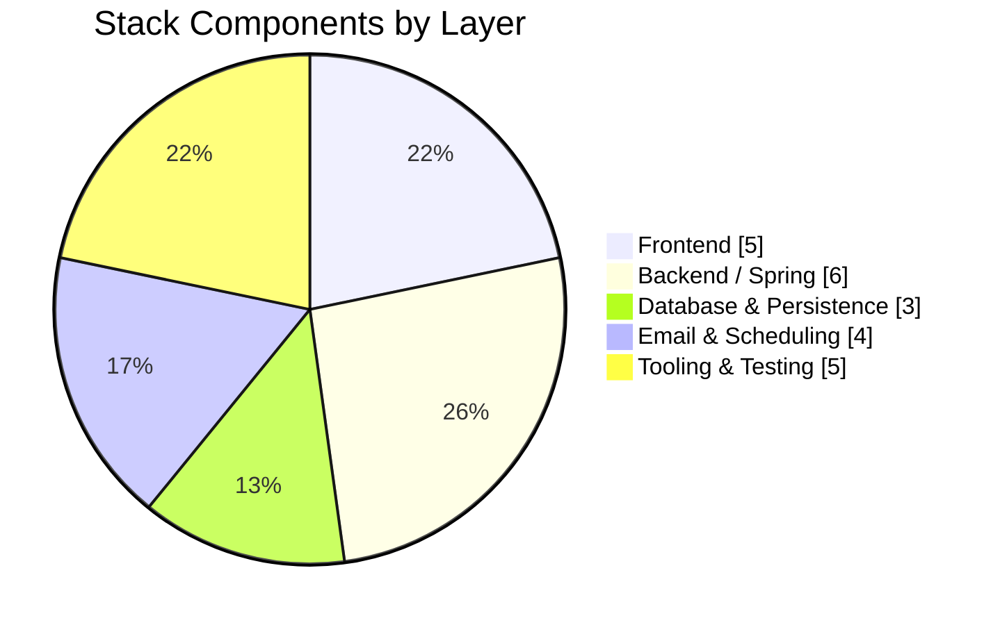
```mermaid
pie showData title Stack Components by Layer
    "Frontend" : 5
    "Backend / Spring" : 6
    "Database & Persistence" : 3
    "Email & Scheduling" : 4
    "Tooling & Testing" : 5
```

---

## 🏗️ System Architecture

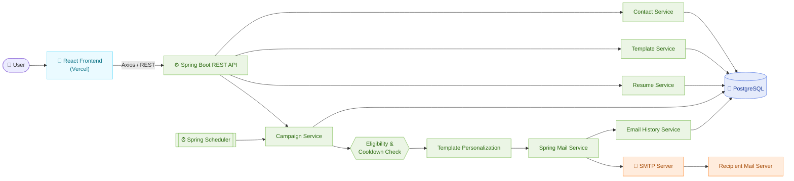
```mermaid
flowchart LR
    U([👤 User]) --> FE["🎨 React Frontend<br/>(Vercel)"]
    FE -->|"Axios / REST"| API["⚙️ Spring Boot REST API"]

    API --> CS[Contact Service]
    API --> TS[Template Service]
    API --> RS[Resume Service]
    API --> CPS[Campaign Service]

    SCH[["⏰ Spring Scheduler"]] --> CPS

    CS --> DB[("🐘 PostgreSQL")]
    TS --> DB
    RS --> DB
    CPS --> DB

    CPS --> EL{{"Eligibility &<br/>Cooldown Check"}}
    EL --> PS[Template Personalization]
    PS --> MS[Spring Mail Service]
    MS --> SMTP[📮 SMTP Server]
    SMTP --> REC[Recipient Mail Server]

    MS --> HIST[Email History Service]
    HIST --> DB

    classDef fe fill:#61DAFB22,stroke:#61DAFB,color:#0b7285
    classDef be fill:#6DB33F22,stroke:#6DB33F,color:#2b6a0f
    classDef db fill:#4169E122,stroke:#4169E1,color:#1c3c9c
    classDef ext fill:#ff6f0022,stroke:#ff6f00,color:#a34700
    class FE fe
    class API,CS,TS,RS,CPS,EL,PS,MS,HIST,SCH be
    class DB db
    class SMTP,REC ext
```

### 🌍 Deployment View

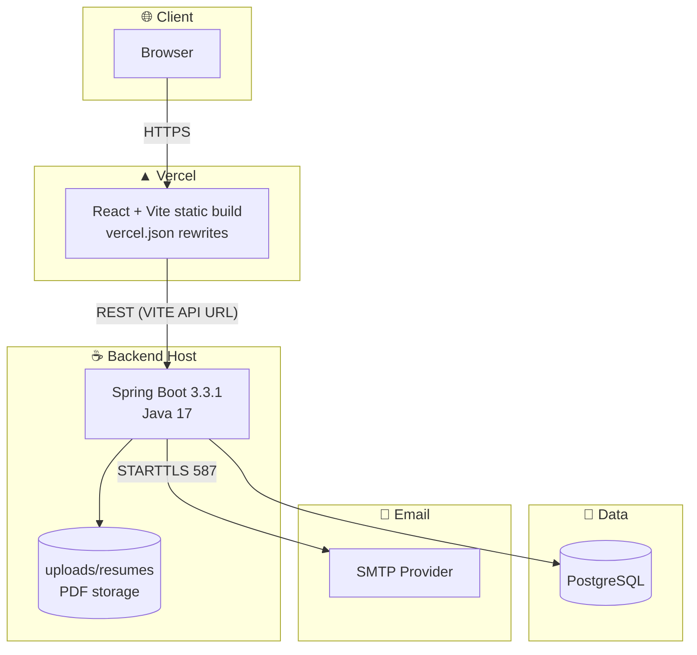
```mermaid
flowchart TB
    subgraph Client["🌐 Client"]
        B[Browser]
    end
    subgraph Vercel["▲ Vercel"]
        F["React + Vite static build<br/>vercel.json rewrites"]
    end
    subgraph BackendHost["☕ Backend Host"]
        S["Spring Boot 3.3.1<br/>Java 17"]
        FS[("uploads/resumes<br/>PDF storage")]
    end
    subgraph Data["💾 Data"]
        P[("PostgreSQL")]
    end
    subgraph Mail["📧 Email"]
        M[SMTP Provider]
    end

    B -->|HTTPS| F
    F -->|"REST (VITE API URL)"| S
    S --> P
    S --> FS
    S -->|"STARTTLS 587"| M
```

### 🧩 Backend Layered Architecture

```text
src/main/java/com/referral/outreach/
│
├── controller/        # REST endpoints
├── service/           # Business logic
├── repository/        # Spring Data JPA repositories
├── entity/            # JPA entities
├── dto/               # API request/response models
├── scheduler/         # Scheduled campaign triggers
├── config/            # CORS, mail and application configuration
├── exception/         # Custom exceptions and global handling
└── util/              # Template/file helper logic
```

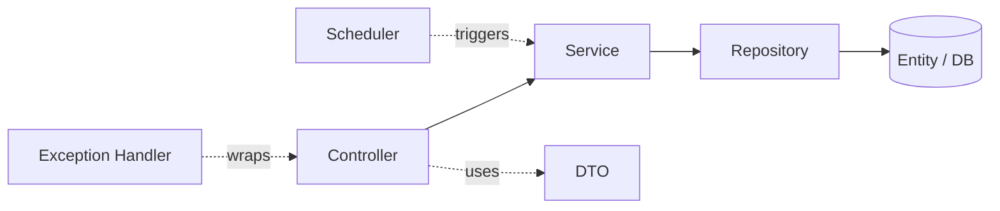
```mermaid
flowchart LR
    C[Controller] --> S[Service] --> R[Repository] --> E[(Entity / DB)]
    C -.uses.-> D[DTO]
    SC[Scheduler] -.triggers.-> S
    X[Exception Handler] -.wraps.-> C
```

> The scheduler stays thin: it only triggers the campaign service, while eligibility checks, personalization, sending, and persistence live in dedicated services.

### 🎨 Frontend Project Layout

```text
Referal_Hub_Frontend/
├── public/              # Static assets
├── src/                 # React application source
├── .env.example         # Environment variable template
├── index.html           # Vite entry
├── package.json         # Scripts & dependencies
├── postcss.config.js    # PostCSS
├── tailwind.config.js   # Tailwind CSS
├── vite.config.js       # Vite config
├── vercel.json          # Vercel routing config
└── .oxlintrc.json       # Oxlint rules
```

---

## 🔄 Workflow Charts

### 1️⃣ End-to-End Campaign Workflow

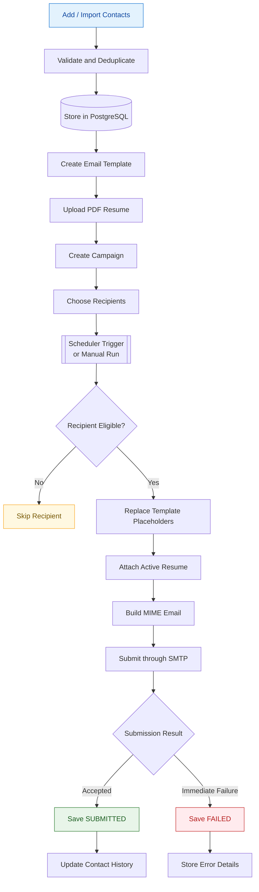
```mermaid
flowchart TD
    A[Add / Import Contacts] --> B[Validate and Deduplicate]
    B --> C[(Store in PostgreSQL)]
    C --> D[Create Email Template]
    D --> E[Upload PDF Resume]
    E --> F[Create Campaign]
    F --> G[Choose Recipients]
    G --> H[["Scheduler Trigger<br/>or Manual Run"]]
    H --> I{Recipient Eligible?}

    I -- No --> J[Skip Recipient]
    I -- Yes --> K[Replace Template Placeholders]
    K --> L[Attach Active Resume]
    L --> M[Build MIME Email]
    M --> N[Submit through SMTP]

    N --> O{Submission Result}
    O -- Accepted --> P[Save SUBMITTED]
    O -- Immediate Failure --> Q[Save FAILED]

    P --> R[Update Contact History]
    Q --> S[Store Error Details]

    style A fill:#e3f2fd,stroke:#1976d2,color:#0d47a1
    style P fill:#e8f5e9,stroke:#2e7d32,color:#1b5e20
    style Q fill:#ffebee,stroke:#c62828,color:#b71c1c
    style J fill:#fff8e1,stroke:#f9a825,color:#7a5900
```

### 2️⃣ Eligibility Decision Flow

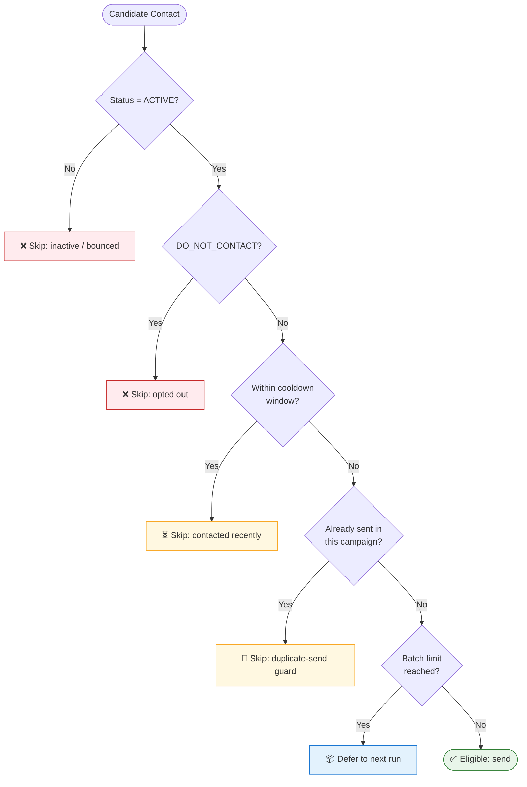
```mermaid
flowchart TD
    S([Candidate Contact]) --> A{Status = ACTIVE?}
    A -- No --> X1[❌ Skip: inactive / bounced]
    A -- Yes --> B{DO_NOT_CONTACT?}
    B -- Yes --> X2[❌ Skip: opted out]
    B -- No --> C{"Within cooldown<br/>window?"}
    C -- Yes --> X3[⏳ Skip: contacted recently]
    C -- No --> D{Already sent in<br/>this campaign?}
    D -- Yes --> X4[🔁 Skip: duplicate-send guard]
    D -- No --> E{Batch limit<br/>reached?}
    E -- Yes --> X5[📦 Defer to next run]
    E -- No --> OK([✅ Eligible: send])

    style OK fill:#e8f5e9,stroke:#2e7d32
    style X1 fill:#ffebee,stroke:#c62828
    style X2 fill:#ffebee,stroke:#c62828
    style X3 fill:#fff8e1,stroke:#f9a825
    style X4 fill:#fff8e1,stroke:#f9a825
    style X5 fill:#e3f2fd,stroke:#1976d2
```

### 3️⃣ Scheduled Campaign Run (Sequence)

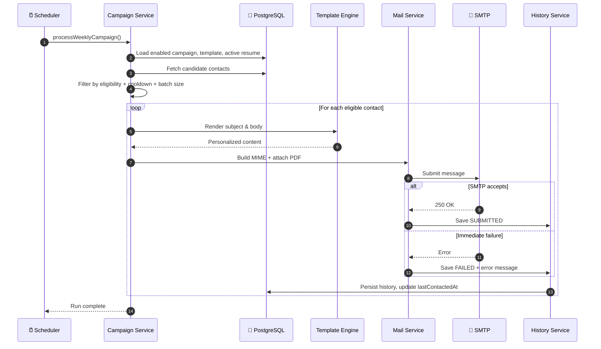
```mermaid
sequenceDiagram
    autonumber
    participant SCH as ⏰ Scheduler
    participant CPS as Campaign Service
    participant DB as 🐘 PostgreSQL
    participant TPL as Template Engine
    participant MAIL as Mail Service
    participant SMTP as 📮 SMTP
    participant HIS as History Service

    SCH->>CPS: processWeeklyCampaign()
    CPS->>DB: Load enabled campaign, template, active resume
    CPS->>DB: Fetch candidate contacts
    CPS->>CPS: Filter by eligibility + cooldown + batch size

    loop For each eligible contact
        CPS->>TPL: Render subject & body
        TPL-->>CPS: Personalized content
        CPS->>MAIL: Build MIME + attach PDF
        MAIL->>SMTP: Submit message
        alt SMTP accepts
            SMTP-->>MAIL: 250 OK
            MAIL->>HIS: Save SUBMITTED
        else Immediate failure
            SMTP-->>MAIL: Error
            MAIL->>HIS: Save FAILED + error message
        end
        HIS->>DB: Persist history, update lastContactedAt
    end

    CPS-->>SCH: Run complete
```

### 4️⃣ Frontend ↔ Backend Interaction

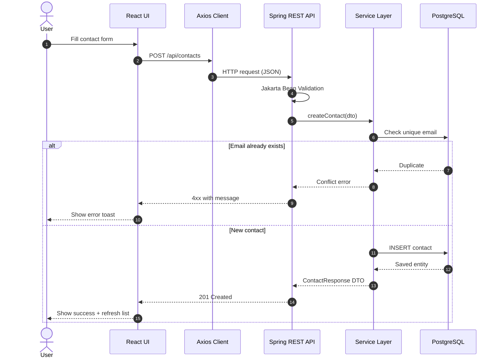
```mermaid
sequenceDiagram
    autonumber
    actor User
    participant UI as React UI
    participant AX as Axios Client
    participant API as Spring REST API
    participant SVC as Service Layer
    participant DB as PostgreSQL

    User->>UI: Fill contact form
    UI->>AX: POST /api/contacts
    AX->>API: HTTP request (JSON)
    API->>API: Jakarta Bean Validation
    API->>SVC: createContact(dto)
    SVC->>DB: Check unique email
    alt Email already exists
        DB-->>SVC: Duplicate
        SVC-->>API: Conflict error
        API-->>UI: 4xx with message
        UI-->>User: Show error toast
    else New contact
        SVC->>DB: INSERT contact
        DB-->>SVC: Saved entity
        SVC-->>API: ContactResponse DTO
        API-->>UI: 201 Created
        UI-->>User: Show success + refresh list
    end
```

### 5️⃣ Resume Upload Flow

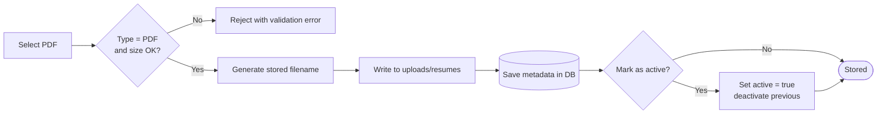
```mermaid
flowchart LR
    U[Select PDF] --> V{"Type = PDF<br/>and size OK?"}
    V -- No --> E[Reject with validation error]
    V -- Yes --> G[Generate stored filename]
    G --> W[Write to uploads/resumes]
    W --> M[(Save metadata in DB)]
    M --> A{Mark as active?}
    A -- Yes --> ACT[Set active = true<br/>deactivate previous]
    A -- No --> DONE([Stored])
    ACT --> DONE
```

### 6️⃣ Email Status Lifecycle

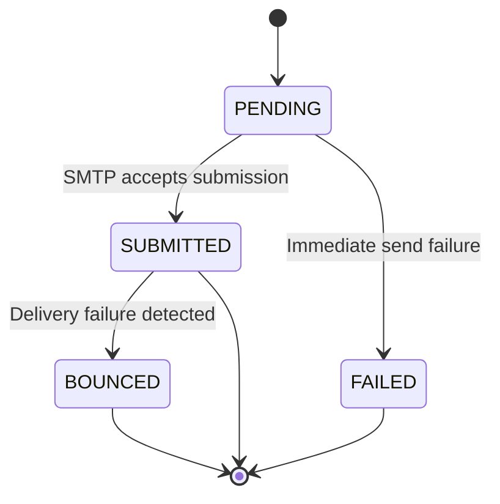
```mermaid
stateDiagram-v2
    [*] --> PENDING
    PENDING --> SUBMITTED: SMTP accepts submission
    PENDING --> FAILED: Immediate send failure
    SUBMITTED --> BOUNCED: Delivery failure detected
    SUBMITTED --> [*]
    FAILED --> [*]
    BOUNCED --> [*]
```

| Status | Meaning |
|:---|:---|
| `PENDING` | Waiting for processing |
| `SUBMITTED` | SMTP server accepted the message |
| `FAILED` | Immediate submission failure |
| `BOUNCED` | Recipient server reported delivery failure |

> [!NOTE]
> Successful SMTP submission does **not** guarantee inbox delivery. A recipient server can reject a message later and generate a bounce notification, so the project distinguishes *submission success* from *final delivery*.

### 7️⃣ Contact Lifecycle

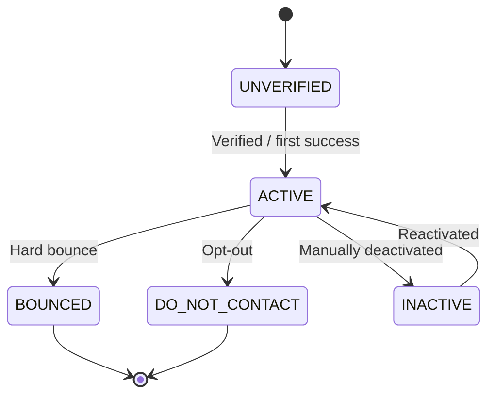
```mermaid
stateDiagram-v2
    [*] --> UNVERIFIED
    UNVERIFIED --> ACTIVE: Verified / first success
    ACTIVE --> BOUNCED: Hard bounce
    ACTIVE --> DO_NOT_CONTACT: Opt-out
    ACTIVE --> INACTIVE: Manually deactivated
    INACTIVE --> ACTIVE: Reactivated
    BOUNCED --> [*]
    DO_NOT_CONTACT --> [*]
```

### 8️⃣ Step-by-Step Explanation

1. **Contact onboarding**: contacts are added through the frontend or imported.
2. **Validation**: the backend validates required fields and blocks duplicate emails.
3. **Template creation**: a reusable subject and body are stored.
4. **Resume selection**: a PDF resume is uploaded and chosen for the campaign.
5. **Campaign setup**: choose template, resume, schedule, and target recipients.
6. **Scheduler trigger**: Spring Scheduler starts processing from the configured cron expression.
7. **Eligibility check**: inactive, recently contacted, bounced, and do-not-contact recipients are filtered out.
8. **Personalization**: placeholders are replaced with recipient and campaign values.
9. **MIME generation**: the email is built and the PDF resume attached.
10. **SMTP submission**: Spring Mail submits the message to the SMTP server.
11. **History update**: the result and any error details are stored.

---

## 🗃️ Data Model

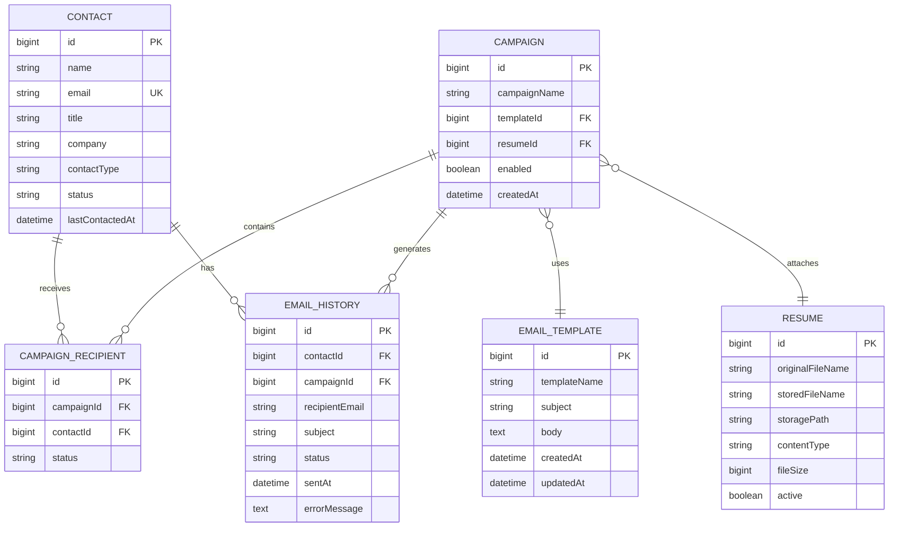
```mermaid
erDiagram
    CONTACT ||--o{ CAMPAIGN_RECIPIENT : receives
    CAMPAIGN ||--o{ CAMPAIGN_RECIPIENT : contains
    CAMPAIGN }o--|| EMAIL_TEMPLATE : uses
    CAMPAIGN }o--|| RESUME : attaches
    CONTACT ||--o{ EMAIL_HISTORY : has
    CAMPAIGN ||--o{ EMAIL_HISTORY : generates

    CONTACT {
        bigint id PK
        string name
        string email UK
        string title
        string company
        string contactType
        string status
        datetime lastContactedAt
    }

    EMAIL_TEMPLATE {
        bigint id PK
        string templateName
        string subject
        text body
        datetime createdAt
        datetime updatedAt
    }

    RESUME {
        bigint id PK
        string originalFileName
        string storedFileName
        string storagePath
        string contentType
        bigint fileSize
        boolean active
    }

    CAMPAIGN {
        bigint id PK
        string campaignName
        bigint templateId FK
        bigint resumeId FK
        boolean enabled
        datetime createdAt
    }

    CAMPAIGN_RECIPIENT {
        bigint id PK
        bigint campaignId FK
        bigint contactId FK
        string status
    }

    EMAIL_HISTORY {
        bigint id PK
        bigint contactId FK
        bigint campaignId FK
        string recipientEmail
        string subject
        string status
        datetime sentAt
        text errorMessage
    }
```

### Service Responsibility Map

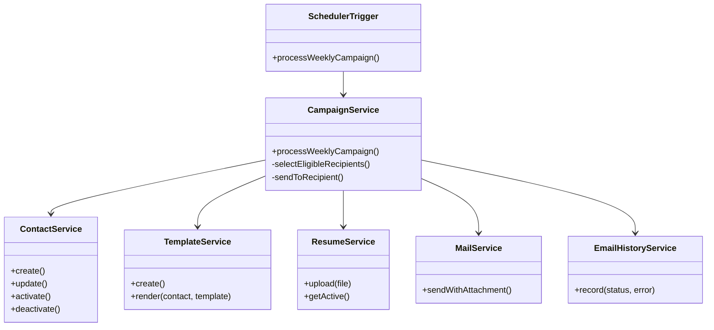
```mermaid
classDiagram
    class SchedulerTrigger {
        +processWeeklyCampaign()
    }
    class CampaignService {
        +processWeeklyCampaign()
        -selectEligibleRecipients()
        -sendToRecipient()
    }
    class ContactService {
        +create()
        +update()
        +activate()
        +deactivate()
    }
    class TemplateService {
        +create()
        +render(contact, template)
    }
    class ResumeService {
        +upload(file)
        +getActive()
    }
    class MailService {
        +sendWithAttachment()
    }
    class EmailHistoryService {
        +record(status, error)
    }
    SchedulerTrigger --> CampaignService
    CampaignService --> ContactService
    CampaignService --> TemplateService
    CampaignService --> ResumeService
    CampaignService --> MailService
    CampaignService --> EmailHistoryService
```

---

## 📊 Data & Analytics Charts

> [!NOTE]
> The numbers in this section are **illustrative sample data** that show what the Campaign Analytics dashboard (see [Roadmap](#️-roadmap)) can display. They are not live production metrics. Replace them with real figures from `EMAIL_HISTORY` when available.

### 🥧 Outreach Outcome Distribution

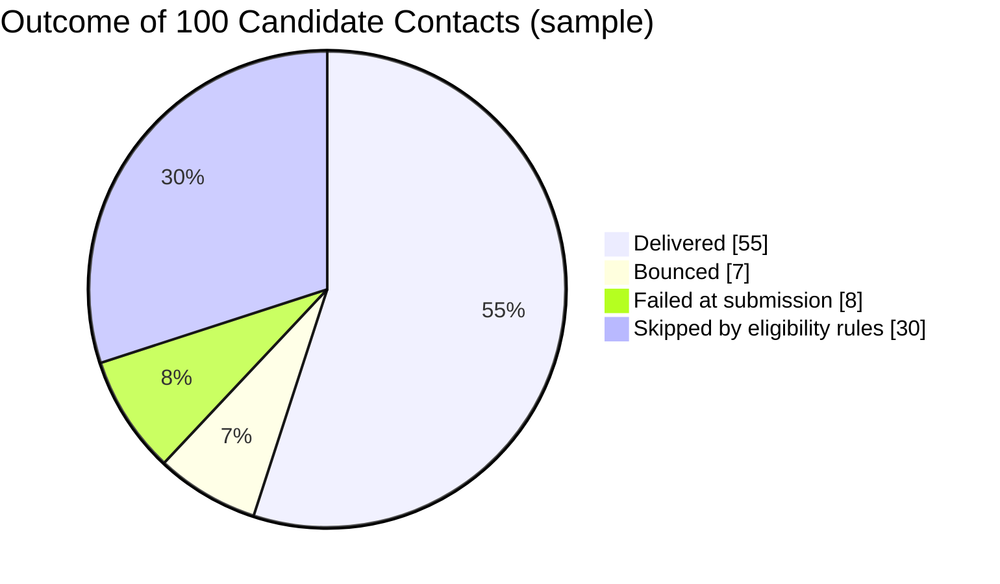
```mermaid
pie showData title Outcome of 100 Candidate Contacts (sample)
    "Delivered" : 55
    "Bounced" : 7
    "Failed at submission" : 8
    "Skipped by eligibility rules" : 30
```

### 📈 Weekly Campaign Volume

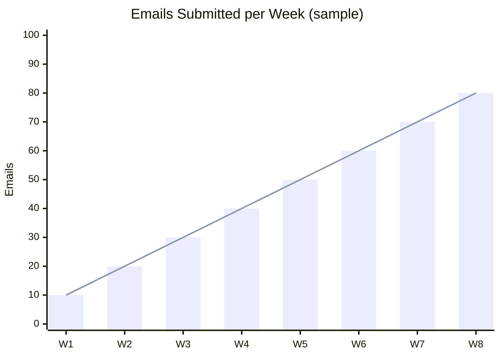
```mermaid
xychart-beta
    title "Emails Submitted per Week (sample)"
    x-axis [W1, W2, W3, W4, W5, W6, W7, W8]
    y-axis "Emails" 0 --> 100
    bar [10, 20, 30, 40, 50, 60, 70, 80]
    line [10, 20, 30, 40, 50, 60, 70, 80]
```

### 📉 Success vs Failure Rate Trend

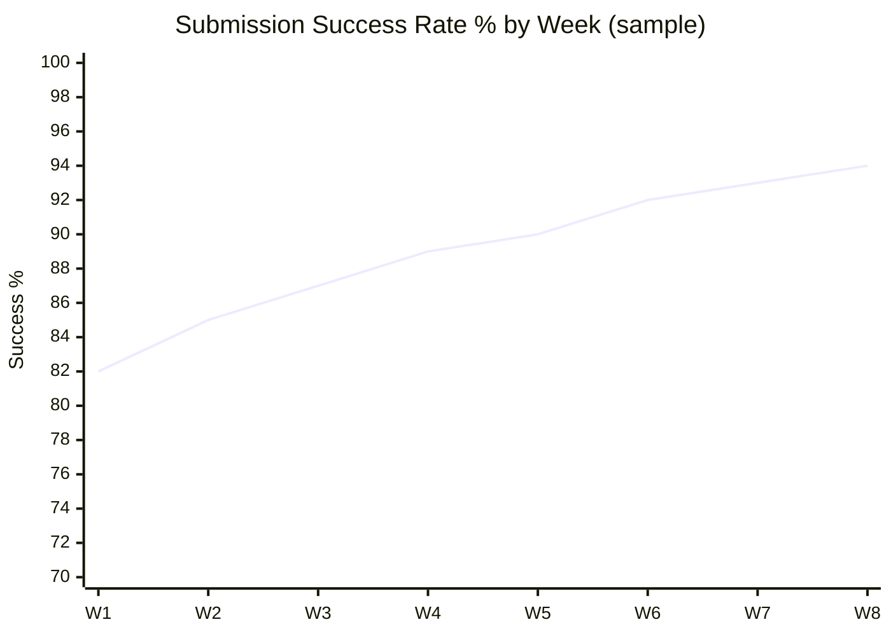
```mermaid
xychart-beta
    title "Submission Success Rate % by Week (sample)"
    x-axis [W1, W2, W3, W4, W5, W6, W7, W8]
    y-axis "Success %" 70 --> 100
    line [82, 85, 87, 89, 90, 92, 93, 94]
```

### 🌊 Outreach Funnel (Sankey)

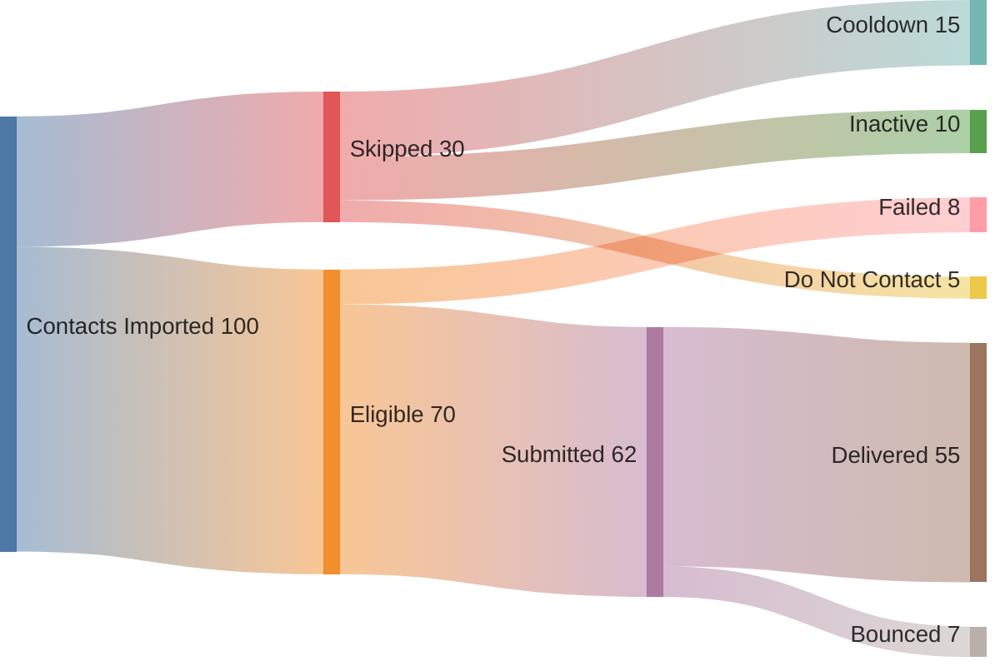
```mermaid
sankey-beta

Contacts Imported,Eligible,70
Contacts Imported,Skipped,30
Skipped,Cooldown,15
Skipped,Inactive,10
Skipped,Do Not Contact,5
Eligible,Submitted,62
Eligible,Failed,8
Submitted,Delivered,55
Submitted,Bounced,7
```

### 👥 Contact Categories

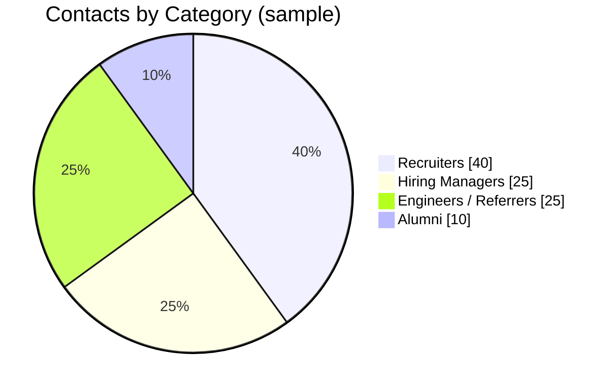
```mermaid
pie showData title Contacts by Category (sample)
    "Recruiters" : 40
    "Hiring Managers" : 25
    "Engineers / Referrers" : 25
    "Alumni" : 10
```

### 🎯 Feature Priority Matrix

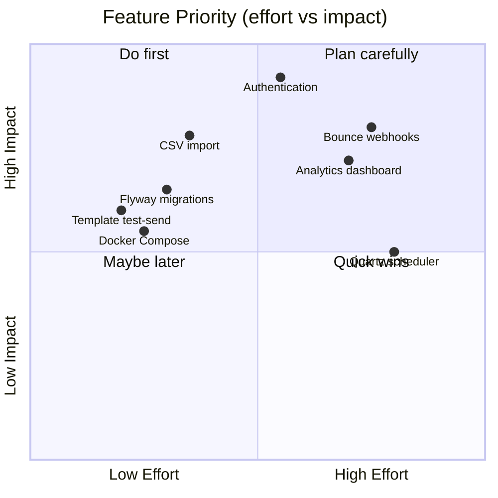
```mermaid
quadrantChart
    title Feature Priority (effort vs impact)
    x-axis Low Effort --> High Effort
    y-axis Low Impact --> High Impact
    quadrant-1 Plan carefully
    quadrant-2 Do first
    quadrant-3 Maybe later
    quadrant-4 Quick wins
    "Authentication": [0.55, 0.92]
    "Bounce webhooks": [0.75, 0.80]
    "CSV import": [0.35, 0.78]
    "Analytics dashboard": [0.70, 0.72]
    "Template test-send": [0.20, 0.60]
    "Docker Compose": [0.25, 0.55]
    "Flyway migrations": [0.30, 0.65]
    "Quartz scheduler": [0.80, 0.50]
```

### 🚶 User Journey Satisfaction

```mermaid
journey
    title A job seeker using Referral Hub
    section Setup
      Add contacts: 4: User
      Create template: 5: User
      Upload resume: 5: User
    section Campaign
      Configure schedule: 4: User
      Scheduler runs automatically: 5: System
      Emails submitted: 5: System
    section Follow-up
      Review history: 4: User
      Handle bounces: 3: User
```

### 🗓️ Project Timeline

```mermaid
gantt
    title Referral Hub Build Plan (illustrative)
    dateFormat  YYYY-MM-DD
    axisFormat  %d %b
    section Backend
    Entities & repositories     :done, b1, 2026-07-01, 4d
    REST controllers & services :done, b2, after b1, 5d
    Scheduler & Spring Mail     :done, b3, after b2, 4d
    section Frontend
    React + Tailwind UI         :done, f1, 2026-07-08, 6d
    Axios integration           :done, f2, after f1, 3d
    section Release
    Vercel deployment           :done, r1, after f2, 2d
    Docs & README               :active, r2, after r1, 2d
```

### 🌿 Suggested Git Workflow

```mermaid
gitGraph
    commit id: "init"
    branch feature/contacts
    commit id: "contact CRUD"
    checkout main
    merge feature/contacts
    branch feature/scheduler
    commit id: "cron + mail"
    commit id: "cooldown rules"
    checkout main
    merge feature/scheduler tag: "v1.0"
    branch feature/analytics
    commit id: "dashboard"
```

---

## 📡 API Overview

| Module | Base Endpoint | Purpose |
|:---|:---|:---|
| 👥 Contacts | `/api/contacts` | Contact CRUD and status management |
| 📝 Templates | `/api/templates` | Email template CRUD |
| 📎 Resumes | `/api/resumes` | Upload and manage PDF resumes |
| 📅 Campaigns | `/api/campaigns` | Campaign configuration and execution |
| 📜 History | `/api/email-history` | Outreach attempt history |

> Endpoint names above are a typical layout. Check the controllers in the backend repository for the exact routes.

---

## ⚙️ Local Setup

### Prerequisites


```mermaid
flowchart LR
    A[1. Clone repos] --> B[2. Create DB] --> C[3. Set env vars] --> D[4. Run backend] --> E[5. Run frontend] --> F([6. Open app])
```

**1. Clone the repositories**

```bash
git clone https://github.com/ashrithBalaji456/Referal_Hub_Backend.git
git clone https://github.com/ashrithBalaji456/Referal_Hub_Frontend.git
```

**2. Create the PostgreSQL database**

```sql
CREATE DATABASE referral_outreach_db;
```

**3. Configure backend environment variables**

```env
DB_HOST=localhost
DB_PORT=5432
DB_NAME=referral_outreach_db
DB_USER=postgres
DB_PASSWORD=your_postgres_password

SMTP_HOST=smtp.gmail.com
SMTP_PORT=587
SMTP_USERNAME=your_email@gmail.com
SMTP_PASSWORD=your_app_password
```

> [!WARNING]
> Never commit `.env` files, database passwords, SMTP credentials, or app passwords.

<details>
<summary><b>4. Example <code>application.yml</code></b></summary>

```yaml
spring:
  datasource:
    url: jdbc:postgresql://${DB_HOST:localhost}:${DB_PORT:5432}/${DB_NAME:referral_outreach_db}
    username: ${DB_USER:postgres}
    password: ${DB_PASSWORD}
    driver-class-name: org.postgresql.Driver

  jpa:
    hibernate:
      ddl-auto: update
    show-sql: true
    properties:
      hibernate:
        format_sql: true

  mail:
    host: ${SMTP_HOST:smtp.gmail.com}
    port: ${SMTP_PORT:587}
    username: ${SMTP_USERNAME}
    password: ${SMTP_PASSWORD}
    properties:
      mail:
        smtp:
          auth: true
          starttls:
            enable: true
            required: true

referral:
  scheduler:
    cron: "0 0 10 * * MON"
    zone: "Asia/Kolkata"
  campaign:
    batch-size: 10
    cooldown-days: 30
```
</details>

**5. Run the backend**

```bash
cd Referal_Hub_Backend
mvn spring-boot:run
```

**6. Run the frontend**

```bash
cd Referal_Hub_Frontend
cp .env.example .env     # then set the backend API URL
npm install
npm run dev
```

The Vite dev server prints the local frontend URL in the terminal.

---

## ⏰ Scheduler

```java
@Scheduled(
    cron = "${referral.scheduler.cron}",
    zone = "${referral.scheduler.zone}"
)
public void processWeeklyCampaign() {
    campaignService.processWeeklyCampaign();
}
```

```text
0 0 10 * * MON
│ │ │  │ │ └── Day of week : Monday
│ │ │  │ └──── Month       : every
│ │ │  └────── Day of month: every
│ │ └───────── Hour        : 10
│ └─────────── Minute      : 0
└───────────── Second      : 0
```

Runs every **Monday at 10:00 AM** in the configured timezone.

---

## 🔐 Security & Configuration Practices

- 🔑 SMTP and database credentials are read from environment variables
- 🚫 Secrets are not committed to source control
- 📧 Contact email addresses are unique
- 🧹 Invalid and bounced contacts can be excluded
- ⏳ Cooldown rules reduce repeated outreach
- 📦 Batch controls prevent uncontrolled campaign execution
- 📄 Uploads are validated for MIME type, extension, and size
- 🗄️ For production, prefer schema migrations (Flyway) over `ddl-auto: update`

```mermaid
flowchart LR
    R[Request] --> V[Bean Validation] --> BL[Business Rules] --> G[Safety Guards] --> OUT[Action]
    G --> G1[Unique email]
    G --> G2[Cooldown]
    G --> G3[Batch size]
    G --> G4[DO_NOT_CONTACT]
```

---

## 🧪 Testing Strategy

| Area | What to cover |
|:---|:---|
| 👥 Contacts | CRUD service tests, duplicate-email validation |
| 📝 Templates | Placeholder replacement tests |
| 🛡️ Eligibility | Recipient eligibility and cooldown tests |
| 📎 Resumes | File validation tests |
| 📅 Campaigns | Campaign processing tests |
| 📧 Mail | Integration tests with a local SMTP test server |
| 💾 Repositories | H2 or PostgreSQL Testcontainers |
| 🔌 API | Integration tests for major workflows |

The backend already includes Spring Boot Test and H2 test dependencies.

```mermaid
flowchart BT
    U["🧱 Unit tests<br/>services, template engine, eligibility"] --> I["🔗 Integration tests<br/>repositories, mail, API"] --> E["🌐 End-to-end<br/>UI + API flows"]
```

---

## 🚧 Challenges & Learnings

<details>
<summary><b>1. SMTP accepted ≠ delivered</b></summary>

```mermaid
flowchart LR
    A[Application] --> B[SMTP Accepted] --> C[Recipient Server] --> D{Result}
    D --> E[📥 Inbox]
    D --> F[↩️ Bounce]
```

A successful `JavaMailSender.send(...)` only confirms submission to the SMTP transport path, not final inbox delivery.
</details>

<details>
<summary><b>2. Keep business logic out of the scheduler</b></summary>

```mermaid
flowchart TB
    S[Scheduler] --> C[Campaign Service] --> E[Eligibility Check] --> T[Template Personalization] --> M[Mail Service] --> H[History Service]
```

This keeps the code testable and makes a future move to Quartz or another job scheduler easier.
</details>

<details>
<summary><b>3. Contact data needs lifecycle management</b></summary>

Imported professional contact data goes stale, so explicit states (`UNVERIFIED → ACTIVE → BOUNCED / DO_NOT_CONTACT`) are essential. See the [Contact Lifecycle](#7️⃣-contact-lifecycle) chart.
</details>

---

## 🗺️ Roadmap

```mermaid
timeline
    title Referral Hub Roadmap
    section Shipped
        July 2026 : Contacts, templates, resumes
                  : Cron scheduler and Spring Mail
                  : React UI deployed on Vercel
    section Next
        Security  : Authentication and roles
                  : Flyway migrations
        Reliability : Retry with exponential backoff
                    : Bounce webhooks
    section Later
        Insights : Analytics dashboard
                 : Per-domain sending limits
        Ops : Docker Compose
            : GitHub Actions pipeline
```

- [ ] Authentication and role-based authorization
- [ ] Quartz Scheduler for database-persisted dynamic jobs
- [ ] Email provider webhooks for automated bounce processing
- [ ] CSV/XLSX contact import with validation reports
- [ ] Campaign analytics dashboard
- [ ] Retry strategy with exponential backoff for transient failures
- [ ] Docker Compose for frontend, backend, and PostgreSQL
- [ ] Flyway database migrations
- [ ] Testcontainers-based PostgreSQL integration testing
- [ ] Deployment pipeline with GitHub Actions
- [ ] Template preview and test-send mode
- [ ] Per-domain and per-campaign sending limits

---

## 📈 GitHub Stats

<div align="center">

<a href="https://github.com/ashrithBalaji456/Referal_Hub_Backend">
  
</a>
<a href="https://github.com/ashrithBalaji456/Referal_Hub_Frontend">
  
</a>

<br/>


</div>

---

## 👨‍💻 Author

<div align="center">

**Gudla Ashrith Balaji**

*Java Backend Developer focused on REST APIs, Spring Boot applications, database-backed systems, and backend automation.*

[](https://www.linkedin.com/in/ashrith-balaji-gudla-5768302a8/)
[](https://github.com/ashrithBalaji456)

</div>

---

## ⭐ Support

If you find this project useful, please give both repositories a ⭐

<div align="center">

[](https://github.com/ashrithBalaji456/Referal_Hub_Backend)
[](https://github.com/ashrithBalaji456/Referal_Hub_Frontend)

### Built with ☕ Java · 🌱 Spring Boot · ⚛️ React · 🐘 PostgreSQL


</div>
